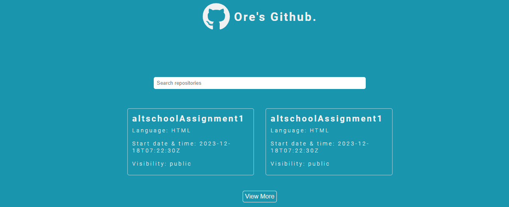
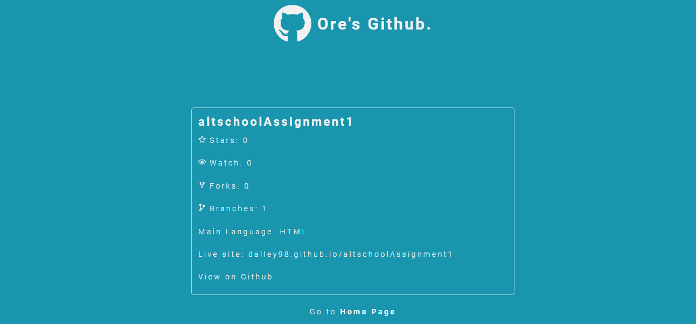

# ALTSCHOOL GITHUB PORTFOLIO EXAM PROJECT

This is a solution to the GitHub portfolio exam by Altschool Africa School of Engineering

## Table of Contents

* Overview
   * Project question
   * Screenshots
   * Link

## Overview 

### Project question
Implement an API fetch of your GitHub portfolio, show a page with a list of all your repositories on GitHub(the page should implement pagination for the repo list), and create another page showing data for a single repo clicked from the list of repos using nested routes while using all the necessary tools in react. Implement the proper SEO, Error Boundary (show a page to test the error boundary) and 404 pages. Good Layout, UI and Designs are essential along with Accesiblity techniques.

### Screenshots
Home Page

Details Page

Error Page

### Link
* Live site URL:

